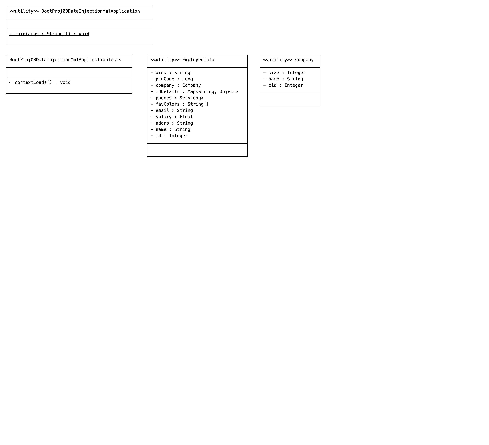

# bootproj08-datainjection-yml
 

# Code
```java
package com.employee;

import org.springframework.boot.SpringApplication;
import org.springframework.boot.autoconfigure.SpringBootApplication;
import org.springframework.context.ApplicationContext;
import org.springframework.context.ConfigurableApplicationContext;

import com.employee.sbeans.EmployeeInfo;

@SpringBootApplication
public class BootProj08DataInjectionYmlApplication {

	public static void main(String[] args) {
		   //get IOC container
		ApplicationContext ctx=SpringApplication.run(BootProj08DataInjectionYmlApplication.class, args);
		  //get  Spring bean class obj ref
		EmployeeInfo  info=ctx.getBean("empInfo",EmployeeInfo.class);
		System.out.println(info);
		
		//close the IOC container
		((ConfigurableApplicationContext) ctx).close();
	}

}
package com.employee.sbeans;

import java.util.Map;
import java.util.Set;

import org.springframework.beans.factory.annotation.Value;
import org.springframework.boot.context.properties.ConfigurationProperties;
import org.springframework.stereotype.Component;

import lombok.Data;

@Component("empInfo")
@Data
@ConfigurationProperties(prefix="emp.info")
public class EmployeeInfo {
    private  Integer id;
    private  String name;
    private   String addrs;
    private   Float salary;
    @Value("${emp.data.email}")
    private   String email;
    private   String[] favColors;
    private   Set<Long> phones;
    private   Map<String,Object> idDetails;
    private   Company  company;
    private   Long  pinCode;
    private  String  area;


}
package com.employee.sbeans;

import lombok.Data;

@Data
public class Company {
    private  Integer  cid;
    private  String  name;
    private   Integer size;
}
```

# Configuration
```properties
emp:
   info: 
       name: raja
       id: 1001
       addrs: hyd
       salary: 89000
     
       fav-colors: 
              -  red
              -  green
              - yellow
       favColors: [red , green,blue] 
            
       phones: 
            - 9999999
            - 8888888
            - 7777777
       idDetails:
            adhar: 10015454
            voterid: 4534555
            passport: 545455
       company: 
            cid: 4567
            name: HCL
            size: 89     
   data:
     email: natarazjavaarena@gmail.com    
       
spring:
  config:
      import: 
         - Info.yml
         - info1.properties
```
```properties
emp:
  info:
     pinCode: 500018
```
```properties
emp.info.area=Sanath Nagar
```

# Dependencies
```xml
<dependencies>
		<dependency>
			<groupId>org.springframework.boot</groupId>
			<artifactId>spring-boot-starter</artifactId>
		</dependency>

		<dependency>
			<groupId>org.projectlombok</groupId>
			<artifactId>lombok</artifactId>
			<optional>true</optional>
		</dependency>
		<dependency>
			<groupId>org.springframework.boot</groupId>
			<artifactId>spring-boot-starter-test</artifactId>
			<scope>test</scope>
		</dependency>
	</dependencies>
```

# UML
